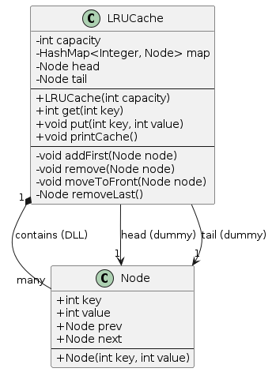
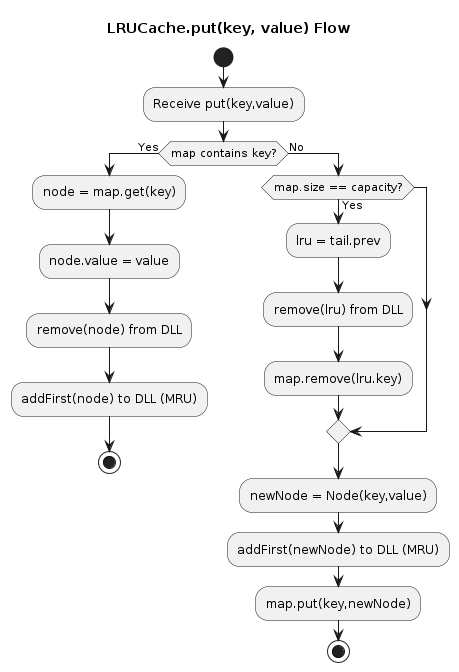
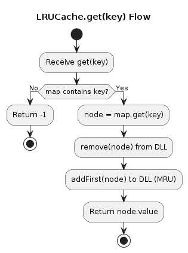

# LRU Cache (Java) – Low Level Design

Implementation of LRU (Least Recently Used) Cache using:
- HashMap
- Doubly Linked List

---

## 📌 Problem Statement

### Design a cache with fixed capacity that supports:

- get(key) → return value if exists else -1
- put(key, value) → insert/update value
- When capacity is full → remove Least Recently Used item

### ⏱ Target Complexity:
- get → **O(1)**
- put → **O(1)**

---

## 🧠 Design Approach

### Why HashMap?
- To get node in **O(1)** time.

### Why Double LinkedList?
- **O(1)** insert and delete
  - Move node to front
  - Remove last node
- To maintain usage order in **O(1)**:

### Why Dummy Node head and tail?
- To avoid null checks.
- **head** represents Most Recently Used (MRU)
- **tail** represents Least Recently Used (LRU)

---

## 🏗 UML Diagram

---

## 🔄 Flowchart – get(key)

---

## 🔄 Flowchart – put(key, value)

